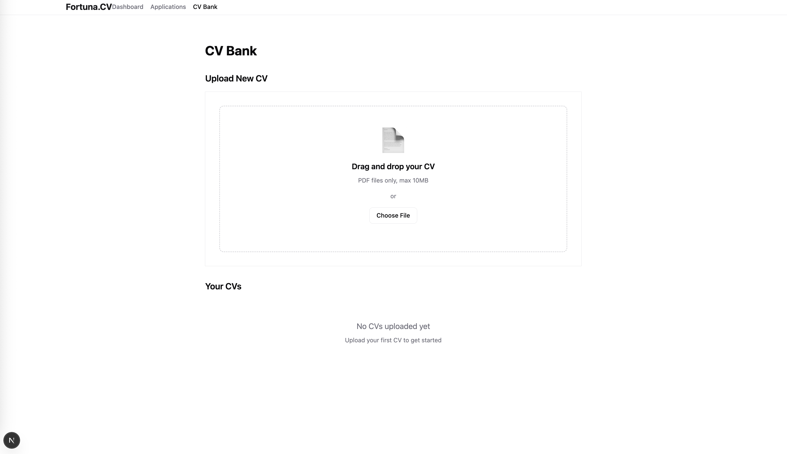

In this post, I will explain all my discoveries on spec-kit. This tool is amazing and here's what I learned for now.

## 1. Spec-Kit ?

Spec-Kit is tool to get you started with `Spec-Driven Development` (SDD). Basically it provides you with a set of commands for your AI CLI Agent.

It connects with most of the popular AI providers oriented in code generation such as OpenAI, Claude, Cursor, Github etc...

It will basically orient your AI Agent with commands and specific prompts to start SDD.

### A. Pre-requisites

You need to have already installed an AI CLI Tool such as Claude which I used in my discovery.

### B. How to install it ?

You should install it globally by doing so :

```bash
uv tool install specify-cli --from git+https://github.com/github/spec-kit.git
```

And that's all ! You're ready to use the speckit CLI.

### C. How to use it ?

First of all, from an existing project or not, run the following command :

```bash
specify init <PROJECT_NAME>
```

It will ask for the AI you want to use and then start working.

At the end of the command, you should have a new folder called `commands`

Those are all the commands provided by `Spec-Kit`. Let's detail them one by one in the order they should be use.

- `/speckit.constitution` : This command is used to govern the AI Agent based on principles and guidelines you want to implement. (or is already implemented for existing project)

  - Here was my prompt for the side project

  ```
  Create principles based on code quality and readability for future developers, user experience consistency and test-driven developments standards.

  Include governance for how these principles should guide technical decisions and implementation choices.
  ```

- `/speckit.specify` : You should really focus on what and why here. You MUST not describe a tech stack. Let's imagine you're a product owner describing your project to a client.
  The first part of the command should focused on the general purpose of the project while the second part should be focused on the specific features you want to implement. The AI will generate User Stories and Acceptance Criteria for the project.
- `/speckit.clarify` : This command is mandatory after you used specify. The AI will ask up to 5 questions to clarify the specifications created. It will updated all the specs and provide you a history of the question and answers session.

This command should also be used during the `implementation` part when you realize that the AI missed or you want to add other features.

- `/speckit.plan` : Describe the tech stack you want to use and your architecture choices. If you are in an existing project, you can also asks the AI to analyze the existing codebase in the prompt and then provide only additionnal informations.
- `/speckit.tasks` : This command will create all the tasks of the implementation based on the specs and the tech stack choosed.
- `/speckit.implement` : This is when the magic happens. The AI starts to implement the project and create all the needed code for you.

## 2. Lifecycle of a project

The lifecycle of a project using `Spec-Kit` is the following :

##### a. Constitution

First, you must use the `/speckit.consitution` command to create the principles of your project. Once you are satisfied with the result, it does not need to be reused. You can always revised the version of your principles as the project evolves, but this is "transversal" to the lifecycle of the project.

##### b. Specifications

Then, you `/speckit.specify` To create specifications for your project. Here was mine :

```
Create and develop an application called [Fortuna.](http://Fortuna.cv)CV (or Fortuna), a platform to handle job applications as a person looking for a job.

This webapp should helps users to organize and SIMPLIFY their jobs processes because we, most of the times, applies to way too much applications for human to be able to follow everyone of them.

The first feature should allow users to create and edit applications and have a global list on those applications. Let’s call this feature “Applications List”. This list should contain for the first version the following informations :

- Name
- Status which can be : First Contact, Job Interview Planned, Pending, Validated, Accepted, Refused
- Current Step which is A free input
- Salary as a Range but can be also a defined number
- Date of the last contact.

The second feature is called “CV Handler”. This feature let users drop CV files as .pdf and can manage them (change name, delete…)

This then allow users to associate CVs to job applications created.

The third feature is called “Application Detail”. When a user click on one application in the “Applications List” they can see the detail of an application. There is a a first part which shows the same fields from the “Applications List” : Name, Status, Current Step, Salary, Date of the last contact which is a summary.

If a user associated a CV to the application, he can click on a button/link “See CV Preview” which opens a sidebar on the right with a pdf viewer containing the CV.

The second part let the user see all the written exchanges made on this application. If there was meetings, it is also showed there as a timeline (from most recent to oldest). For the initial phase of the project, this will be a manual input, so there will be a “Plus button” somewhere letting him choose between a meeting and a written exchange, if it’s a meeting he can add the name of the people he met, the date of the meeting, and a little description of the meeting. For the written part, he must have somewhere to copy/past the exchange and he must fill the name (either him or the person he met) and the date of the exchange.

The fourth and last feature is called “Applications Dashboard”, This let the user see key informations :

- A counter of job applications
- A Line chart showing the number of applications made per week.
- A Pie chart on the answers rate : In the last month, how many applications are in “First Contact” status for more than 4 days versus how many are not in “First Contact” status.
    - This Pie chart part should have a trending indicator next to his title showing how the percentage of status not in “First Contact” increased or decreased
- A Scatter Chart showing the salary proposed by companies (only for the applications that are not in a “First Contact” status) along time going.

Those are the core features of the application. For now, don’t include a login feature as we just want to test everything. You can just have a “faked” user to associate all the testing data to him.

Later we will add high added value features to the application.
```

##### c. Clarify the specifications

Use the `/speckit.clarify` command to clarify the specifications. It will starts asking 5 questions and you'll have to answer them.

Then, you `/speckit.plan` for the techstack. This command is very different when you are in an existing project or not. I couldn't test an existing codebase yet.

##### d. Plan the tech stack

This command is like `/constitution` but for the tech stack. There's no need to reuse apart when you want to update or evolve the tech stack.

##### e. Create the tasks for the agent

Then, you `/speckit.tasks` to create the tasks for the implementation. This is very useful for the AI-Agent but there is not much to say, it's very intuitive.

###### f. Implement the project

Finally, you `/speckit.implement` to implement the project. This is the most important command. It will create all the needed code for you. It can take some time because you'll go back-and-forth with the AI Agent to implement the project.

To resume you have :

- On first run : `constitution` -> `specify` -> `clarify` -> `plan` -> `tasks` -> `implement`
- On next runs : `specify` -> `clarify` -> `tasks` -> `implement`

##### g. Conclusion

So whenever you want to update your project, you can reuse the second lifecycle. Once you've done it a first time, it gets way easier ! It's also reduce the time taken to implement since the core part is already done.

## 3. Results

Here was my first result :



It was not pretty, but it was very functional.

### a. Remarks

Here was my remarks on the first lifecycle :

1. The AI Agent is not very good in User Experience. You should still have some work to be done after the implementation, mostly on that part.
2. The AI Agent used Tailwind CSS for the styling. It worked but it did not try to create reusable components for layout and stuff like this. At the end you have a very messy code with a lot of class names everywhere. But this is something you can ask the AI Agent to train in order to get better with the plan and constitution commands.
3. The AI Agent is very good at testing. It creates lots of tests and can coverage most of your code. It's not perfect since it does not always understand why he is adding a test, but it saves you so much times anyway.
4. The AI Agent is not good at creating config files and setup things. You should asks the AI to let you do it manually and then proceed by analyzing what you have done, it works way better.

### b. Data

Here was the coverage of my project after the first lifecycle :

% Coverage report from v8

File | % Stmts | % Branch | % Funcs | % Lines | Uncovered Line #s

All files | 65.75 | 83.57 | 70.06 | 65.75 |  
 apps/web/src/app | 0 | 0 | 0 | 0 |  
 layout.tsx | 0 | 0 | 0 | 0 | 1-25  
 page.tsx | 0 | 0 | 0 | 0 | 1-7  
 apps/web/src/app/api/applications | 100 | 80 | 100 | 100 |  
 route.ts | 100 | 80 | 100 | 100 | 49-54  
 ...eb/src/app/api/applications/[id] | 98.14 | 63.15 | 100 | 98.14 |  
 route.ts | 98.14 | 63.15 | 100 | 98.14 | 72-73  
 apps/web/src/app/api/cvs | 100 | 90 | 100 | 100 |  
 route.ts | 100 | 90 | 100 | 100 | 30  
 apps/web/src/app/api/cvs/[id] | 100 | 100 | 100 | 100 |  
 route.ts | 100 | 100 | 100 | 100 |  
 apps/web/src/app/api/timeline | 100 | 100 | 100 | 100 |  
 route.ts | 100 | 100 | 100 | 100 |  
 apps/web/src/app/api/timeline/[id] | 100 | 100 | 100 | 100 |  
 route.ts | 100 | 100 | 100 | 100 |  
 ...timeline/entries/[applicationId] | 100 | 100 | 100 | 100 |  
 route.ts | 100 | 100 | 100 | 100 |  
 apps/web/src/app/applications | 0 | 0 | 0 | 0 |  
 ApplicationListClient.tsx | 0 | 0 | 0 | 0 | 1-62  
 page.tsx | 0 | 0 | 0 | 0 | 1-15  
 apps/web/src/app/applications/[id] | 0 | 0 | 0 | 0 |  
 ApplicationDetailClient.tsx | 0 | 0 | 0 | 0 | 1-89  
 page.tsx | 0 | 0 | 0 | 0 | 1-24  
 apps/web/src/app/cv-bank | 0 | 0 | 0 | 0 |  
 CvBankClient.tsx | 0 | 0 | 0 | 0 | 1-103  
 page.tsx | 0 | 0 | 0 | 0 | 1-16  
 apps/web/src/app/dashboard | 0 | 0 | 0 | 0 |  
 page.tsx | 0 | 0 | 0 | 0 | 1-97  
 apps/web/src/features/Applications | 94.66 | 85.08 | 77.77 | 94.66 |  
 AddTimelineDialog.tsx | 98 | 83.33 | 77.77 | 98 | 51-52,68-69  
 ApplicationDetail.tsx | 85.42 | 77.27 | 60 | 85.42 | ...07-120,123-134
ApplicationForm.tsx | 100 | 86.84 | 83.33 | 100 | ...41,152,165,182
ApplicationList.tsx | 94.3 | 84.21 | 80 | 94.3 | 39-40,96-100  
 AutocompleteInput.tsx | 95.23 | 100 | 80 | 95.23 | 52-54  
 TimelineList.tsx | 98.37 | 85.71 | 100 | 98.37 | 52-53  
 apps/web/src/features/CvBank | 57.42 | 91.3 | 50 | 57.42 |  
 CvList.tsx | 96.69 | 95.45 | 53.84 | 96.69 | 86-90,93-94  
 CvUploadZone.tsx | 0 | 0 | 0 | 0 | 1-145  
 apps/web/src/features/Hooks | 14.19 | 83.33 | 50 | 14.19 |  
 useApplicationAutocomplete.ts | 100 | 100 | 100 | 100 |  
 useIndexedDbStorage.ts | 0 | 0 | 0 | 0 | 1-139  
 apps/web/src/lib | 0 | 0 | 0 | 0 |  
 utils.ts | 0 | 0 | 0 | 0 | 1-6  
 packages/shared/src/db | 100 | 100 | 100 | 100 |  
 applications.ts | 100 | 100 | 100 | 100 |  
 cvs.ts | 100 | 100 | 100 | 100 |  
 timeline.ts | 100 | 100 | 100 | 100 |  
 packages/shared/src/db/**mocks** | 100 | 100 | 100 | 100 |  
 client.ts | 100 | 100 | 100 | 100 |  
 packages/shared/src/lib | 99 | 89.65 | 100 | 99 |  
 calculations.ts | 99.14 | 91.3 | 100 | 99.14 | 223-224  
 generators.ts | 100 | 100 | 100 | 100 |  
 validators.ts | 98.49 | 81.81 | 100 | 98.49 | 84-85  
 packages/ui/src/components | 0 | 0 | 0 | 0 |  
 MetricsCard.tsx | 0 | 0 | 0 | 0 | 1-24  
 packages/ui/src/components/Charts | 0 | 0 | 0 | 0 |  
 LineChart.tsx | 0 | 0 | 0 | 0 | 1-40  
 PieChart.tsx | 0 | 0 | 0 | 0 | 1-41  
 packages/ui/src/components/Layout | 0 | 0 | 0 | 0 |  
 Navbar.tsx | 0 | 0 | 0 | 0 | 1-44  
 index.ts | 0 | 0 | 0 | 0 | 1  
 packages/ui/src/components/shadcn | 69.39 | 86.2 | 65.78 | 69.39 |  
 Badge.tsx | 100 | 50 | 100 | 100 | 31  
 Button.tsx | 100 | 50 | 100 | 100 | 47  
 Card.tsx | 40.67 | 100 | 14.28 | 40.67 | ...47,49-51,53-57
Dialog.tsx | 95.12 | 100 | 80 | 95.12 | 13-15,21-23  
 Form.tsx | 0 | 0 | 0 | 0 | 1-138  
 Input.tsx | 100 | 100 | 100 | 100 |  
 Label.tsx | 100 | 100 | 100 | 100 |  
 Select.tsx | 87.03 | 100 | 70 | 87.03 | ...,84-92,114-122
Tabs.tsx | 100 | 100 | 100 | 100 |  
 Textarea.tsx | 100 | 100 | 100 | 100 |  
 index.ts | 0 | 0 | 0 | 0 | 1-9  
 packages/ui/src/lib | 100 | 100 | 100 | 100 |  
 utils.ts | 100 | 100 | 100 | 100 |  
 prisma | 0 | 0 | 0 | 0 |  
 seed.ts | 0 | 0 | 0 | 0 | 1-257

### c. Next steps

For my part, as I wanted to use the tool as much as possible, I made loops until I was satisfied with the result.
